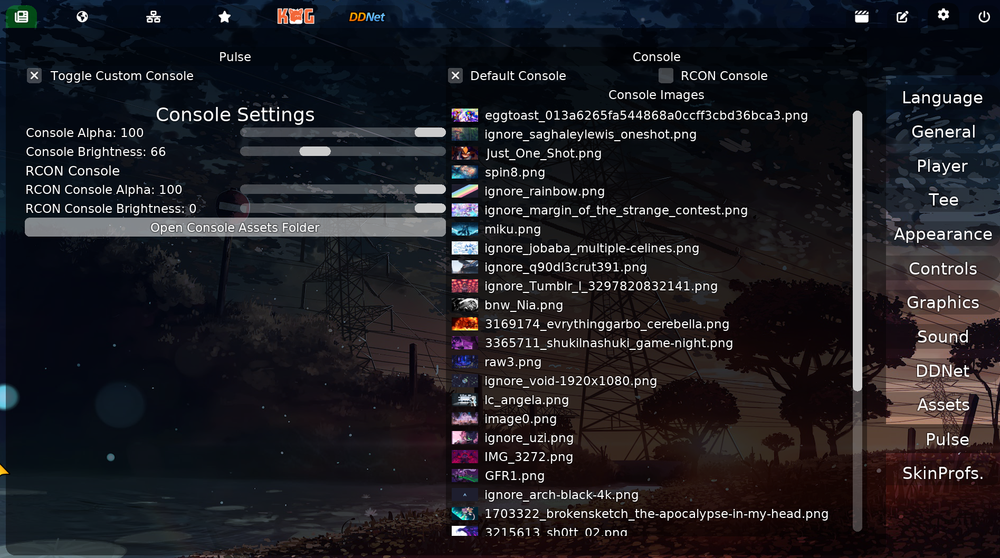
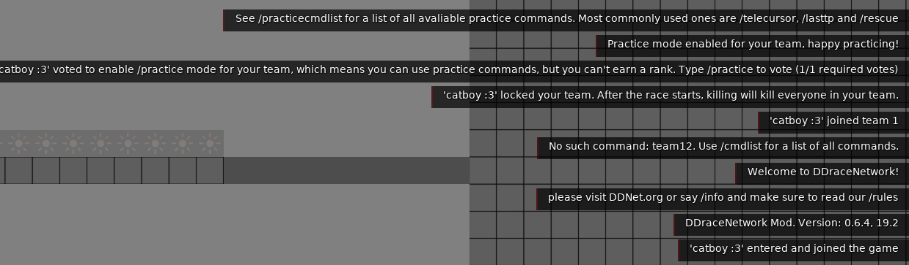
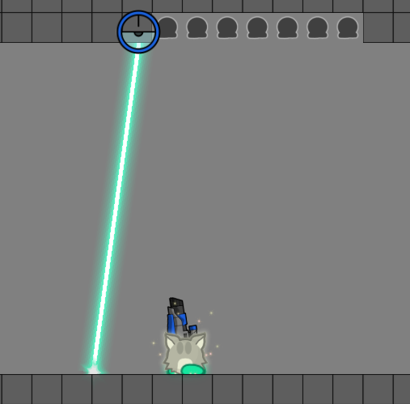
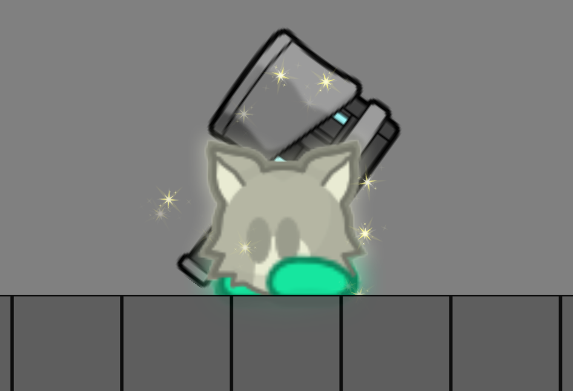

# *DDNET PULSE*

  

A customized DDraceNetwork client focusing on enhanced gameplay information visualization and quality-of-life features. Based on the DDNet codebase with additional features.

## **We don't mind using the features from client for own purpose, but we still prefer PR**
## Features

- Console customization
- Better server messages
- Enhanced laser effects
- Idle effects enhanced
- *Tater*: SkinProfilse
- *Tater*:Fast input
- *DuckDDNet*: Nameplates status

## Showcase

## Building & Requirements 
Requirements:
- Basis ddnet libraries
- Socket.IO
- Socketcpp

Follow standard [DDNet](https://github.com/ddnet/ddnet) building instructions for your platform
